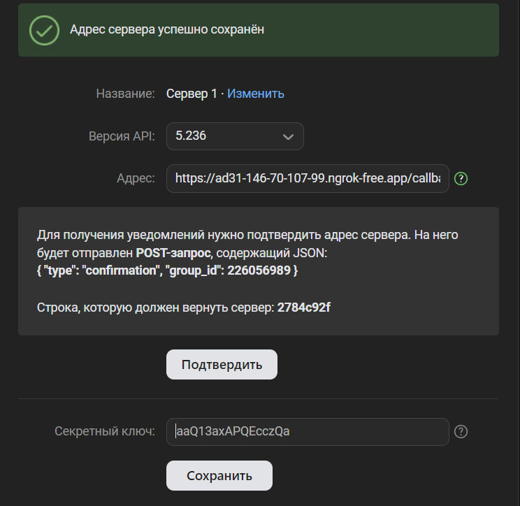

# Чат бот ВК

1. Запустите `ngrok http 8052`
2. Потом создайте файл env.properties в папке с vk-bot, чтобы он выглядел как example-env.properties, сделаю это на примере 
    1. vk.secret - секретный ключ
    2. vk.confirmation-code - cтрока, которую должен вернуть сервер: 2784c92f
    3. vk.group-id=226056989 - Для получения уведомлений нужно подтвердить адрес сервера. На него будет отправлен POST-запрос, содержащий JSON: { "type": "confirmation", <b> "group_id": 226056989 <b/>}
    4. vk.access-key - вы должны получить из VK API
3. Далее запустите приложение с помощью ./gradlew bootRun или просто из Intelij Idea
4. Все, бот работает